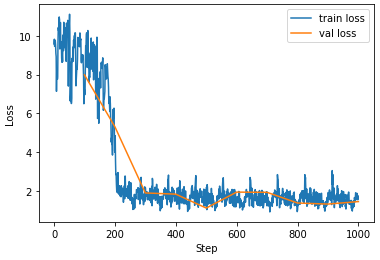
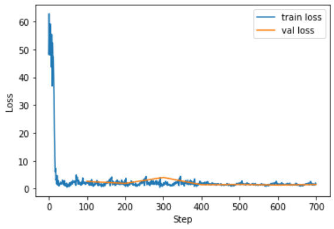
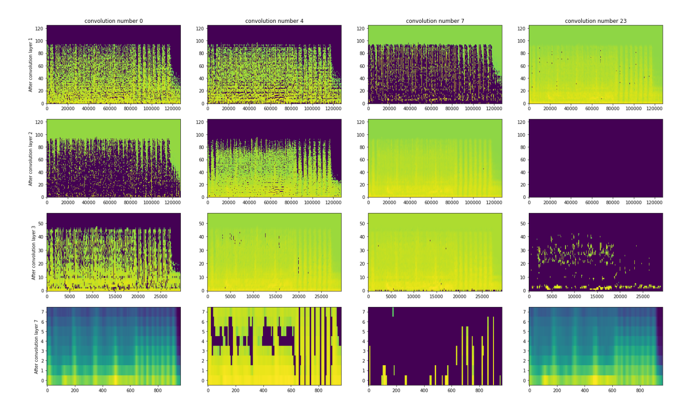
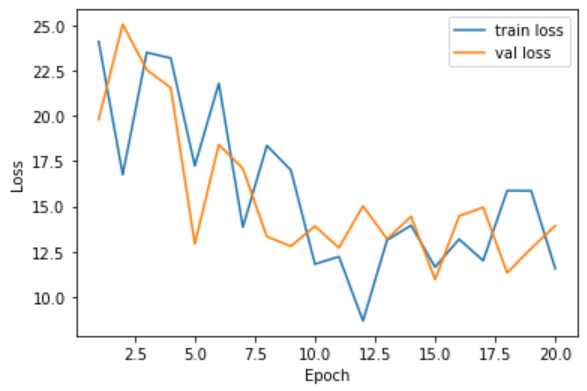
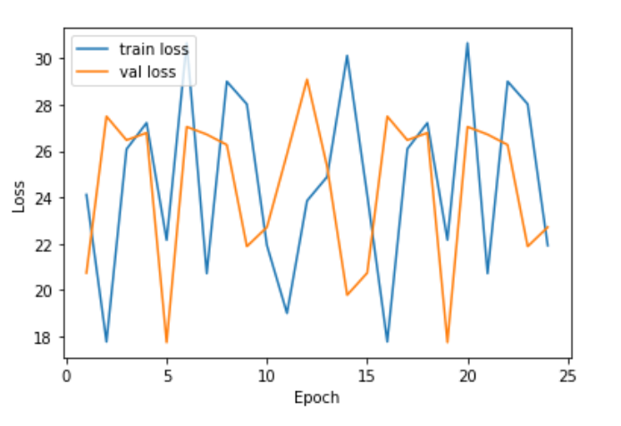
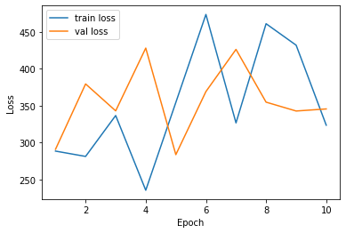

# Music Emotion Recognition Algorithm using Deep Learning.
Author: Alex Nguyen. Gettysburg College

`(Introduction to be written)`

## Requirements:
1. System: Window. Linux and mac not supported (This is because the kernel and libraries in `requirements.txt` are specialized to window)
2. Dataset:
 * DEAM Dataset: [https://www.kaggle.com/imsparsh/deam-mediaeval-dataset-emotional-analysis-in-music](https://www.kaggle.com/imsparsh/deam-mediaeval-dataset-emotional-analysis-in-music)
3. VS Code (in order to run the jupyter notebook with python file: VS Code format)

## Project structure
* `docs`: Containing images for documentation
* `mer`: The core libraries for model training and evaluating
  * `__init__.py`: Package initialization
  * `const.py`: Constant for the library 
  * `loss.py`: Loss functions for the deep learning model
  * `model.py`: Deep learning models
  * `utils.py`: Utilization methods
* `main_dynamic.py`: Main jupython notebook (python format) for training with data with per-second label.
* `main_static.py`: Main jupython notebook (python format) for training with data with whole song label.
* `requirements.txt`: Dependency file
* `wav_converter.py`: Script to convert every mp3 file in a folder into wav format.

## How to run the project

* First, install the required libraries: 
  ```
  conda create -n mer
  conda activate mer
  pip install -r requirements.txt
  ```
* Next, go into one python file `main_dynamic.py` or `main_static.py` and experiment with the VS Code notebook.

## Misc:
* convert to wav code: 
  ```
  cd audio
  mkdir wav
  for %f in (*.mp3) do (ffmpeg -i "%f" -acodec pcm_s16le  -ar 44100  "./wav/%f.wav")
  ```
  or
  ```
  python wav_converter.py {src} {dst} {ffmpeg bin path}
  # E.g: python wav_converter.py "./dataset/DEAM/audio" "./dataset/DEAM/wav" "C:/Users/Alex Nguyen/Documents/ffmpeg-master-latest-win64-gpl/bin/ffmpeg.exe"
  ```

## Reports

### Jan 4, 2022
* We want to experiement with depth-wise and point-wise (mobile net) convolution to reduce computational cost but still want to keep the same performance.

### Jan 3, 2022
* We tried CRNN Model with CBAM architecture with shallow gru (1 layer of gru). first 3 epoch (300 steps of batch_size 16), we train with learning rate 1e-3, next 1e-4. We use mae loss throughout the training process. We achieve the similar loss to other models.

### Dec 31, 2021
* We tried CRNN Model with deep gru (3 layer of gru)

  <!--  -->
  

### Dec 30, 2021
* We tried CRNN Model with shallow bidirectional lstm

  <!-- 
   -->
  
  

### Dec 28, 2021
* We tried CRNN Model

  <!--  -->
  

### Dec 26, 2021
* We tried testing with Simple CNN Model with 5 Convolution Block (each block consists of a convolution layer with filer size (3,3) and leaky relu activation followed by a convolution layer with filer size (1,1) and leaky relu activation). Each double the number of neurons (64, 128, 256, 512, 1024). Here is the training result after 25 epochs:
 <!--  -->
 

### Dec 25, 2021
* The Music Information Retrieval (MIR) field has always been challenging because there are not a lot of refined dataset constructed. Especially for Music Emotion Recognition (MER) task, to assess the emotion of the song, one has to collect the songs as input (most of them is not possible because of copyright [\[1\]](https://journals.plos.org/plosone/article?id=10.1371/journal.pone.0173392)). According to Aljanaki et. al [\[1\]](https://journals.plos.org/plosone/article?id=10.1371/journal.pone.0173392), the emotion is subjective to human and language and therefore hard to be determined. There are a lot of emotion labeling scheme such as the emotion adjective wording scheme from Lin et. al [\[2\]](https://doi.org/10.1145/2037676.2037683) or the two dimensional regression scheme from the DEAM dataset developed by Aljanaki et. al [\[1\]](https://journals.plos.org/plosone/article?id=10.1371/journal.pone.0173392) which utilize the two orthorgonal psychology states that are discussed by Russel [\[3\]](https://www.researchgate.net/publication/235361517_A_Circumplex_Model_of_Affect). 
* There are a lot of traditional musical emotion recognition models that utilize sound processing and musical feature detection from the waveform and the spectrogram of the sound such as Improved Back Propagation network [\[4\]](https://www.frontiersin.org/articles/10.3389/fpsyg.2021.760060/full), MIDI notes, melodic, and dynamic features [\[5\]](https://www.semanticscholar.org/paper/Novel-Audio-Features-for-Music-Emotion-Recognition-Panda-Malheiro/6feb6c070313992897140a1802fdb8f0bf129422)
* The dataset we use is the DEAM dataset which was developed by Aljanaki et. al [\[1\]](https://journals.plos.org/plosone/article?id=10.1371/journal.pone.0173392). The dataset contain 1082 45-second mp3 soundtrack and a set of annotation. The annotations consist of average static (whole song) and dynamic (each second) label of the valence/arousal point on the grade of 10.
* As in the beginning of the project, we experiment with most popular method nowaday: deep learning. We want to apply deep learning into assessing the MER task by having the music (and potentially its related standard (Panda et. al [\[5\]](https://www.semanticscholar.org/paper/Novel-Audio-Features-for-Music-Emotion-Recognition-Panda-Malheiro/6feb6c070313992897140a1802fdb8f0bf129422)) and derived features) as input to the deep learning schema, and the annotated valence-arousal point (ranged from 0 to 10) as label.
* We want to firstly test if the linear dense network to see if they accurately predict the two value valence and arousal. We first preprocess the music audio by performing stft on the waveform to get the time-frequency spectrogram of the sound which is represented by a 3D array \[`time_length`, `n_frequency`, `n_channel`\] (a typical spectrogram of a 45 second music will have the shape (15502, 129, 2)). We then resize such data into the smalller size (i.e, (512, 129, 2)) using bilinear method. We then Flatten the array and feed the vector of 512 * 129 * 2 through 4 linear layers of 512, 256, 128, and 64 neurons with activation of rectified linear unit. The last layer is also a Linear layer that have 2 neurons as output with a rectified linear unit activation. We simplly use the l2 loss to the the distance of the output neurons from the actuall labelled valence and arousal. For optimizer, we use stochastic gradient descent with learning rate of 1e-4. After training the model with batch size 16, step per epoch 100, and 10 epoch, we get the following total loss for batch. So the mean squared error should be `loss` / `batch_size`.

   

## Resources

* Database benchmark: 

https://journals.plos.org/plosone/article?id=10.1371/journal.pone.0173392

```
@article{AlajankiEmoInMusicAnalysis,
author = {Alajanki, Anna and Yang, Yi-Hsuan and Soleymani, Mohammad},
title = {Benchmarking music emotion recognition systems},
journal = {PLOS ONE},
year = {2016},
note= {under review}
}
```

https://www.kaggle.com/imsparsh/deam-mediaeval-dataset-emotional-analysis-in-music
https://cvml.unige.ch/databases/DEAM/
https://cvml.unige.ch/databases/DEAM/manual.pdf

https://www.semanticscholar.org/paper/The-AMG1608-dataset-for-music-emotion-recognition-Chen-Yang/16a21a57c85bae0ada26454300dc5c5891f1c0e2

The PMEmo Dataset for Music Emotion Recognition. https://dl.acm.org/doi/10.1145/3206025.3206037
https://github.com/HuiZhangDB/PMEmo

RAVDESS database: https://zenodo.org/record/1188976

* label scheme:

Lin, Y. C., Yang, Y. H., and Homer, H. (2011). Exploiting online music tags for music emotion classification. ACM Trans. Multimed. Comput. Commun. Appl. 7, 1–16. doi: 10.1145/2037676.2037683

Russell, James. (1980). A Circumplex Model of Affect. Journal of Personality and Social Psychology. 39. 1161-1178. 10.1037/h0077714. 

* Technical: 

https://www.tensorflow.org/io/tutorials/audio
https://librosa.org/
https://www.tensorflow.org/tutorials/audio/simple_audio

Visual attention: https://www.youtube.com/watch?v=1mjI_Jm4W1E
Visual attention notebook: https://github.com/EscVM/EscVM_YT/blob/master/Notebooks/0%20-%20TF2.X%20Tutorials/tf_2_visual_attention.ipynb

YAMNet: https://github.com/tensorflow/models/blob/master/research/audioset/yamnet/yamnet.py

* Related work and works

most influlece library mir search: https://www.semanticscholar.org/search?fos%5B0%5D=computer-science&q=Music%20Emotion%20Recognition&sort=influence

Audio-based deep music emotion recognition: https://www.semanticscholar.org/paper/Audio-based-deep-music-emotion-recognition-Liu-Han/6c4ed9c7cad950a6398a9caa2debb2dea0d16f73

A Novel Music Emotion Recognition Model Using Neural Network Technology: https://www.frontiersin.org/articles/10.3389/fpsyg.2021.760060/full

novel features of music for mer: https://www.semanticscholar.org/paper/Novel-Audio-Features-for-Music-Emotion-Recognition-Panda-Malheiro/6feb6c070313992897140a1802fdb8f0bf129422

musical texture and espresitivity features: https://www.semanticscholar.org/paper/Musical-Texture-and-Expressivity-Features-for-Music-Panda-Malheiro/e4693023ae525b7dd1ecabf494654e7632f148b3

specch recognition: http://proceedings.mlr.press/v32/graves14.pdf

data augmentation: https://paperswithcode.com/paper/specaugment-a-simple-data-augmentation-method

rnn regularization technique: https://paperswithcode.com/paper/recurrent-neural-network-regularization

wave to vec: https://paperswithcode.com/paper/wav2vec-2-0-a-framework-for-self-supervised

* MER Task:

Music Mood Detection Based On Audio And Lyrics With Deep Neural Net: https://paperswithcode.com/paper/music-mood-detection-based-on-audio-and
Transformer-based: https://paperswithcode.com/paper/transformer-based-approach-towards-music

tutorial ismir: https://arxiv.org/abs/1709.04396

* DNN-based:

https://www.semanticscholar.org/paper/Music-Emotion-Classification-with-Deep-Neural-Nets-Pandeya-Bhattarai/023f9feb933c6e82ed2e7095c285e203d31241dc


* crnn based:

Recognizing Song Mood and Theme Using Convolutional Recurrent Neural Networks: https://www.semanticscholar.org/paper/Recognizing-Song-Mood-and-Theme-Using-Convolutional-Mayerl-V%C3%B6tter/5319195f1f7be778a04186bfe4165e3516165a19

Convolutional Recurrent Neural Networks for Music Classification: https://arxiv.org/abs/1609.04243

* cnn-based:

https://www.semanticscholar.org/paper/CNN-based-music-emotion-classification-Liu-Chen/63e83168006678410d137315dd3e8488136aed39

https://www.semanticscholar.org/paper/Recognition-of-emotion-in-music-based-on-deep-Sarkar-Choudhury/396fd30fa5d2e8821b9413c5a227ec7c902d5b33

https://www.semanticscholar.org/paper/Music-Emotion-Recognition-by-Using-Chroma-and-Deep-Er-Aydilek/79b35f61ee84f2f7161c98f591b55f0bb31c4d0e

* Attention:

Emotion and Themes Recognition in Music with Convolutional and Recurrent Attention-Blocks: https://www.semanticscholar.org/paper/Emotion-and-Themes-Recognition-in-Music-with-and-Gerczuk-Amiriparian/50e46f65dc0dd2d09bb5a08c0fe4872bbe5a2810

CBAM: https://arxiv.org/abs/1807.06521